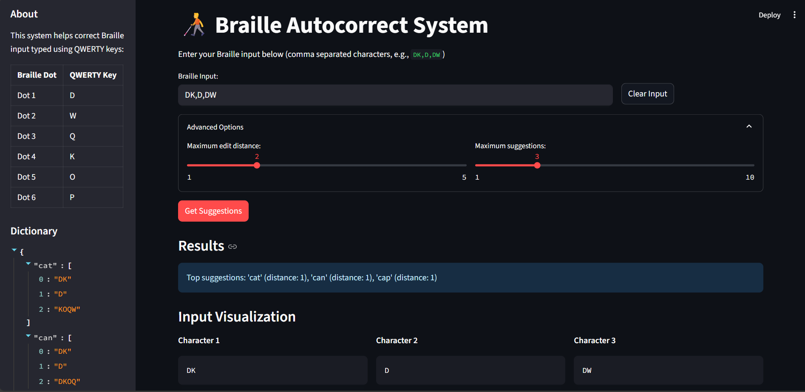
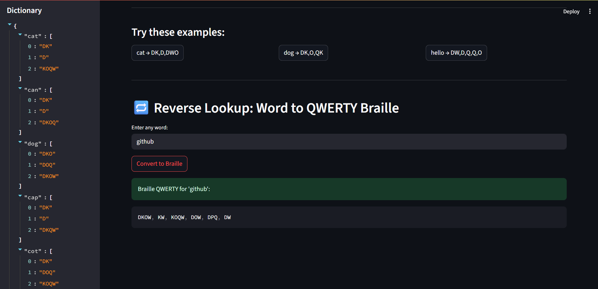
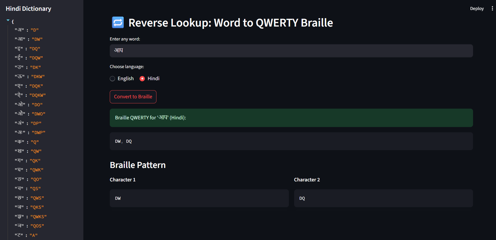
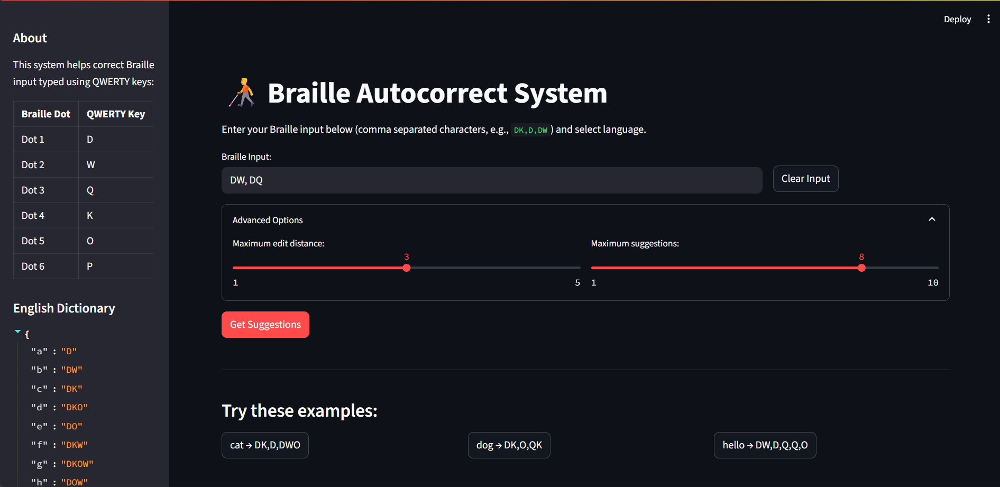

# QWERTY-Braille Autocorrect System


## 📌 Overview

The **QWERTY-Braille Autocorrect System** is an intelligent tool that corrects and suggests text typed in Braille using QWERTY keyboard input. It is designed to help visually impaired users and developers working on accessible applications by providing accurate conversion and autocorrection between Braille sequences and Hindi/English text.

## 🚀 Features

* 🔤 **Braille to Text Suggestion** using edit distance (Levenshtein distance).
* 🔁 **Reverse Lookup** from Hindi or English text to QWERTY Braille key codes.
* 📚 Built-in dictionaries for **English** and **Hindi** Braille.
* ⚙️ Advanced controls to tweak distance and suggestion count.
* 🧠 Intelligent corrections using **BK-Tree** search.
* 🧑‍🦯 Streamlit interface designed with accessibility in mind.

## 🛠️ Technologies Used

* **Python**
* **Streamlit** – for web UI
* **Levenshtein Distance Algorithm** – for fuzzy matching
* **BK-Tree (Burkhard-Keller Tree)** – for optimized approximate search
* **QWERTY-to-Braille Mapping** – custom mapping logic for Dot patterns

## 🧮 Algorithms and Methods

### 🔹 BK-Tree for Fuzzy Matching

A BK-Tree is a data structure that allows fast querying of similar items based on a distance metric. Here it is used to store normalized Braille inputs and quickly retrieve the closest matching words.

### 🔹 Levenshtein Distance

Used as the distance metric in the BK-Tree, the Levenshtein algorithm calculates how many insertions, deletions, or substitutions are needed to transform one Braille input into another.

### 🔹 Normalization of Input

Each character's Braille input is sorted and converted to a consistent format so comparisons are accurate even if users input unordered keys (e.g., `WD` is same as `DW`).

## 🌐 Languages Supported

* **English**: Standard lowercase alphabet a-z mapped to QWERTY Braille.
* **Hindi**: Vowels, consonants, and matras supported via custom mappings.
## 📸 Screenshots

<div align="center">
  
  
</div>

<br>

<div align="center">
  
  
</div>


## 🧪 Sample Use Case

* **Input:** `DK,D,DW`
* **Interpreted as:** Braille keys for `C, A, T`
* **Output:** Suggestion - `cat` (distance 0)

## 💡 Future Improvements

* 🔉 Add text-to-speech feedback
* 🌍 Support for more regional languages
* 📲 Mobile-friendly UI
* 🧩 Integrate OCR for Braille image recognition

---
> "Making accessibility mainstream through code."

---

## 📦 How to Run

To launch the **QWERTY-Braille Autocorrect System**, follow these steps:

```bash
# 1. Install dependencies
pip install streamlit

# 2. Run the application
streamlit run QWERTY-Braille.py  #for english

streamlit run QWERTY-Braille-en-hn.py  #for hindi+english


